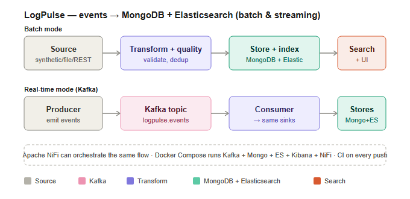
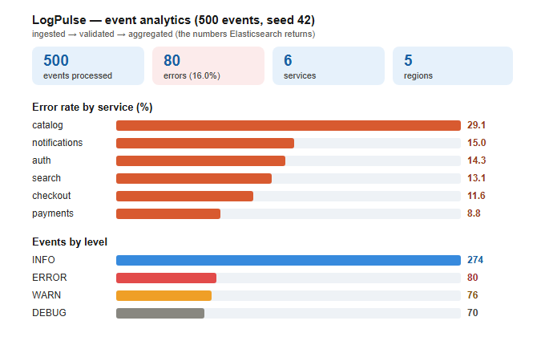

# LogPulse — events → MongoDB + Elasticsearch (batch **and** streaming)

[](https://github.com/mohamed-abo-taha/logpulse-search/actions/workflows/ci.yml)


An event-processing pipeline that ingests service log/telemetry events, stores
them as documents in **MongoDB**, and indexes them into **Elasticsearch** for
full-text search and aggregations — running both as a **batch** job and as a
**real-time Kafka stream**, with an **Apache NiFi** flow and a **Streamlit**
search UI.

> Built to demonstrate MongoDB, Elasticsearch, NiFi, REST ingestion, OOP and
> analytical thinking — plus real-time streaming as a stretch.

### Architecture



### Event analytics output



---

## Data flow

```
                         ┌───────────────► MongoDB (document system-of-record)
 Source ─► Transform ─►  │
 (events) (validate +    └───────────────► Elasticsearch (search + aggregations) ─► Search / Dashboard
           quality gate)

 Two ways to drive it:
   • BATCH     run_pipeline.py        source → transform → fan out to both sinks
   • STREAMING run_producer.py  ─►  Kafka topic  ─►  run_consumer.py → both sinks
```

* **Sources** — `SyntheticSource` (deterministic generated events), `FileSource`
  (replay JSON), `RestSource` (pull from an HTTP endpoint).
* **Transform** — normalise, validate, deduplicate (`EventTransformer`), with a
  `QualitySuite` of declarative checks (`src/quality.py`).
* **Sinks** — `MongoStore` and `ESIndexer` both implement the same `Sink`
  interface, so the pipeline fans out to both without special-casing either.
* **Search** — full-text queries + aggregations (`src/search.py`, `search_cli.py`).

## OOP design

`Source` and `Sink` are abstract base classes (`src/base.py`). MongoDB and
Elasticsearch are interchangeable sinks; the `Pipeline` and the Kafka
`EventConsumer` both write to "a list of sinks" without knowing which stores
they are. Adding a third destination is a one-liner.

## Project layout

```
project-2-logpulse-search/
├── run_pipeline.py        # BATCH ingest → Mongo + ES
├── run_producer.py        # STREAMING: emit events to Kafka
├── run_consumer.py        # STREAMING: consume Kafka → Mongo + ES
├── search_cli.py          # query the ES index (text / errors / report)
├── dashboard.py           # Streamlit search + analytics UI
├── docker-compose.yml     # Kafka + MongoDB + Elasticsearch + Kibana + NiFi
├── Dockerfile
├── src/
│   ├── base.py            # abstract Source / Sink (OOP)
│   ├── models.py          # Event domain object
│   ├── generator.py       # Synthetic / File / Rest sources
│   ├── transform.py       # clean / validate / dedup
│   ├── quality.py         # data-quality framework
│   ├── mongo_store.py     # MongoDB sink
│   ├── es_indexer.py      # Elasticsearch sink
│   ├── search.py          # search + aggregations
│   ├── streaming.py       # Kafka producer + consumer
│   └── pipeline.py        # batch orchestrator
├── nifi/                  # Apache NiFi flow spec + docs
└── tests/                 # offline pytest suite (10 tests)
```

## Quick start

```bash
pip install -r requirements.txt

# Offline — needs no services
python -m pytest -q                       # 10 tests
python run_pipeline.py --dry-run          # generate + transform only

# Full stack
docker compose up -d                      # Kafka + Mongo + ES + Kibana + NiFi

# Batch mode
python run_pipeline.py --source synthetic --verbose
python search_cli.py text "timeout"
python search_cli.py report               # error-rate + p95 latency + regions

# Real-time streaming mode
python run_producer.py --rounds 10 &      # stream batches of events to Kafka
python run_consumer.py                    # index them the moment they arrive

# Dashboard
streamlit run dashboard.py
```

## Endpoints (after `docker compose up -d`)

| Service | URL |
| ------- | --- |
| Kafka broker | `localhost:9092` |
| Redpanda console (Kafka UI) | http://localhost:8085 |
| MongoDB | `mongodb://localhost:27017` |
| Elasticsearch | http://localhost:9200 |
| Kibana | http://localhost:5601 |
| NiFi | https://localhost:8443/nifi |

## Apache NiFi

The same pipeline is also expressed as a NiFi flow (ingest → validate → route →
PutMongo → PutElasticsearch). See [`nifi/README.md`](nifi/README.md).

## Skills demonstrated

- **MongoDB** — document modelling, bulk upserts, indexes, aggregation pipeline.
- **Elasticsearch** — explicit mapping, bulk indexing, full-text search, aggregations.
- **Kafka** — real-time producer/consumer streaming with the same sinks as batch.
- **OOP** — abstract `Source`/`Sink`, polymorphism, dependency inversion.
- **REST / data between systems** — `RestSource` + NiFi `InvokeHTTP`.
- **Analytical thinking** — error-rate, p95 latency and region aggregations.
- **Data quality, NiFi orchestration, Docker, Streamlit** — production extras.
